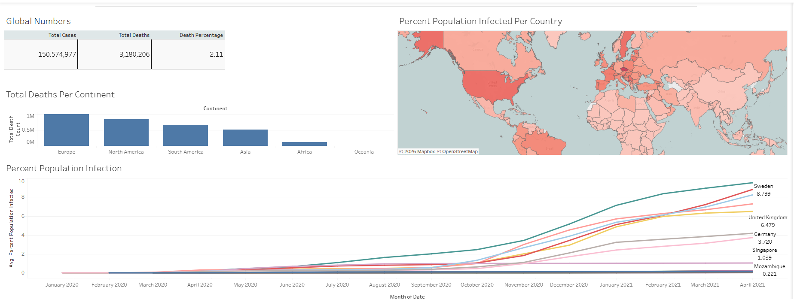

# Global COVID-19 Impact Analysis: Infection Rates, Mortality Trends, and Geographic Risk Assessment

## Executive Summary

This project analyzes global COVID-19 data to evaluate mortality impact, infection rates, and geographic differences in pandemic outcomes. Using SQL for data extraction and transformation and Tableau for visualization, this analysis identifies key performance indicators and trends to support data-driven conclusions.

Key metrics such as total deaths, global death percentage, and percent population infected were calculated to understand the overall severity and spread of COVID-19.

---

## Business Problem

COVID-19 had a significant global impact, but the severity varied across countries and continents. This project aims to answer critical analytical questions relevant to global health monitoring and risk assessment:

- What is the global COVID-19 death percentage?
- Which continent experienced the highest death count?
- How did infection rates vary across different countries?
- Are there observable differences between developed and developing countries?

---

## Dataset

**Source:** Our World in Data  
https://ourworldindata.org/covid-deaths

This analysis uses two primary datasets: COVID-19 deaths and COVID-19 vaccinations. Both datasets were originally part of a single unified dataset from Our World in Data. For the purpose of practicing relational database concepts and SQL joins, the data was intentionally split into two separate tables and later recombined using JOIN operations. This allowed for more realistic data modeling and demonstrated the ability to integrate multiple data sources for comprehensive analysis.

### CovidDeathsMain Dataset Includes:

- ISO country code
- Continent and country location
- Date of record
- Population size
- Total COVID-19 cases
- New daily cases
- Total COVID-19 deaths
- New daily deaths
- Cases per million population
- Deaths per million population
- Reproduction rate
- ICU patient counts
- Hospital patient counts
- Weekly hospital and ICU admissions

### CovidVaccinations Dataset Includes:

- Total COVID-19 vaccinations
- People vaccinated
- People fully vaccinated
- New daily vaccinations
- Vaccination rates per hundred people
- COVID-19 testing counts
- Positive test rates
- Population density
- Median age
- GDP per capita
- Human Development Index (HDI)
- Life expectancy
- Hospital beds per thousand
- Smoking rates and health indicators

---

## Tools and Technologies Used

- SQL (SQLite DB Browser)
- Tableau
- Excel

---

## Technical Skills Demonstrated

The technical skills included:

- SQL Joins
- Common Table Expressions (CTEs)
- Window Functions (PARTITION BY)
- Aggregate Functions (SUM, MAX, CAST)
- Data Cleaning and Transformation
- KPI Calculation
- Dashboard Development
- Data Visualization
- Trend Analysis
- Geographic Analysis

---

## Methodology

SQL was used to extract, clean, and analyze COVID-19 data. Key calculations included:

- Total global deaths
- Global death percentage
- Percent population infected per country
- Death count by continent
- Infection trends over time

The transformed data was then visualized using Tableau to identify trends and communicate insights effectively.

---

## Key Business Questions and Findings

### What is the global COVID-19 death percentage?

Global death percentage:

**2.11%**

This indicates that approximately 2 out of every 100 confirmed COVID-19 cases resulted in death globally.

---

### Which continent had the highest death count?

**Europe recorded the highest total COVID-19 death count**

This highlights the severity of the pandemic across European countries.

---

### How did infection rates vary across countries?

Analysis showed that:

- Developed countries had significantly higher reported infection rates
- Less developed countries reported lower infection percentages

Possible contributing factors include:

- Greater testing availability in developed countries
- Differences in reporting accuracy
- Public health infrastructure variations
- Population density differences

---

## Dashboard

View Interactive Tableau Dashboard:

https://public.tableau.com/app/profile/nelson.pham1144/viz/CovidDashboard_17717197375120/Dashboard1

Dashboard features include:

- Global KPI summary
- Death count by continent
- Geographic infection heat map
- Infection trend analysis over time

---

## Key Insights

Major insights from this analysis include:

- Global death rate was 2.11%
- Europe experienced the highest total deaths
- Developed countries reported higher infection penetration
- Asia showed comparatively lower infection percentages
- Infection rates increased significantly during late 2020 and early 2021

---

## Project Files

- SQL Analysis Script
- Tableau Dashboard
- Dataset
- Visualizations

---

## What This Project Demonstrates

This project reflected my skills for:

- Writing complex SQL queries
- Transforming raw data into meaningful insights
- Building professional dashboards
- Analyzing global datasets
- Communicating findings clearly

---

## Author

Nelson Pham

Business Analytics Student  
Aspiring Data Analyst  

Tableau Portfolio:  
https://public.tableau.com/app/profile/nelson.pham1144
